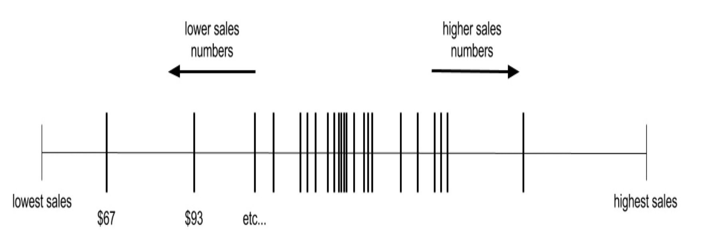
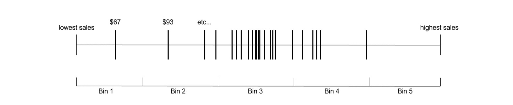
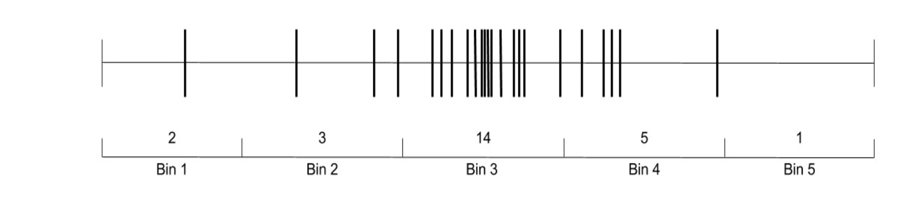
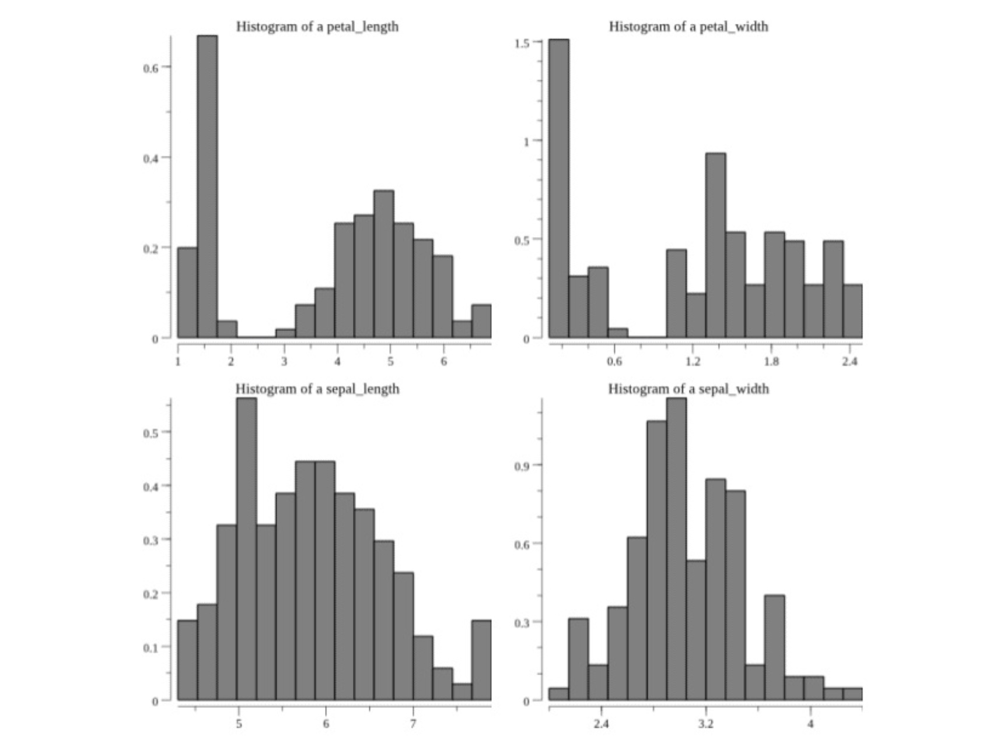

# 统计

归根结底，机器学习应用程序的成功将取决于数据的质量，对数据的理解以及对结果的评估/验证。 所有这三件事都要求我们对统计数据有所了解。


统计领域有助于我们了解我们的数据，并量化我们的数据和结果。 它还为我们提供了一些机制，以衡量我们的应用程序的性能如何，并防止某些机器学习陷阱（例如过拟合）。


与线性代数一样，我们无法在此处对统计进行完整介绍，但是在线和印刷版中有许多资源可供学习入门统计。在这里，我们将着重于对基础知识的基本理解以及在Linux中实现的实用性。 走。 我们将介绍分布的概念，以及对这些分布进行量化和可视化的介绍。


## 分布

分布表示值在数据集中出现的频率。例如，假设您作为数据科学家正在跟踪的一件事是某项产品或服务的每日销售额，并且您有一长串（可以表示为矢量或矩阵的一部分）清单数字。这些销售数字是我们数据集的一部分，其中包括一天的销售额为121美元，另一天的销售额为207美元，依此类推。


在我们累积的销售数量中，有一个销售数量是最低的。在我们已累积的销售编号中，也将有一个最高的销售编号，而其余的销售编号则介于两者之间（至少，如果我们假设没有确切的重复编号）。下图显示了这些销售价值的低，高和中间值：因此，这是销售的分布，或者至少是销售分布的一种表示。请注意，此分布具有数量较多的区域和数量稀疏的区域。另外，请注意，数字似乎在分布的中心附近是有倾向性的。




因此，这是销售的分布，或销售分布的至少一种表示。 请注意，此分布具有数量较多的区域和数量稀疏的区域。 另外，请注意，数字似乎在分布的中心附近是有倾向性的。

## 统计量度

为了量化分布的样子，我们将使用各种统计量度。通常，这些量度有两种类型：

> 1.集中趋势度量：这些度量衡量大多数值的位置或分布中心的位置（例如，沿着前面的线性表示）。

> 2.散布或散布度量：这些度量用于衡量分布的值如何分布在分布的范围内（从最低值到最高值）。

有多种软件包可让您快速计算和/或利用这些统计量度。 我们将使用gonum.org/v1/gonum/stat（您可能开始注意到我们将大量使用gonum）和github.com/montanaflynn/stats。

请注意，thegonum.org / v1 / gonum / statandgithub.com / montanaflynn / statspackages的名称存在一个字母差异，请注意以下各节中的示例。

### 集中趋势的量度

集中趋势的度量包括：
> Mean: 这就是您通常所说的平均值。 我们通过对分布中的所有数字求和，然后除以数字数来计算。
> Median: 如果我们将分布中的所有数字从最低到最高进行排序，则该数字将数字的最低一半与数字的最高一半分隔开。
> Mode: 这是分布中最频繁出现的值。

让我们针对第1章“收集和组织数据”中先前介绍的虹膜数据集的一列中的值计算这些度量。 提醒一下，此数据集包括四列花朵测量值，以及一列相应的花卉种类。 因此，每个度量值列都包含代表该度量值分布的一组值：

```
// Open the CSV file.
irisFile, err := os.Open("../data/iris.csv")
if err != nil {
    log.Fatal(err)
}
defer irisFile.Close()

// Create a dataframe from the CSV file.
irisDF := dataframe.ReadCSV(irisFile)

// Get the float values from the "sepal_length" column as
// we will be looking at the measures for this variable.
sepalLength := irisDF.Col("sepal_length").Float()

// Calculate the Mean of the variable.
meanVal := stat.Mean(sepalLength, nil)

// Calculate the Mode of the variable.
modeVal, modeCount := stat.Mode(sepalLength, nil)

// Calculate the Median of the variable.
medianVal, err := stats.Median(sepalLength)
if err != nil {
    log.Fatal(err)
}

// Output the results to standard out.
fmt.Printf("\nSepal Length Summary Statistics:\n")
fmt.Printf("Mean value: %0.2f\n", meanVal)
fmt.Printf("Mode value: %0.2f\n", modeVal)
fmt.Printf("Mode count: %d\n", int(modeCount))
fmt.Printf("Median value: %0.2f\n\n", medianVal)
```

运行此程序将导致以下结果：

```
$ go build
$ ./myprogram

Sepal Length Summary Statistics:
Mean value: 5.84
Mode value: 5.00
Mode count: 10
Median value: 5.80
```

您可以看到均值，众数和中位数略有不同。 但是，请注意，sepal_length列中的值的平均值和中位数非常接近。

另一方面，如果在前面的代码中将sepal_length更改为花瓣长度，我们将得到以下结果：

```
$ go build
$ ./myprogram

Sepal Length Summary Statistics:
Mean value: 3.76
Mode value: 1.50
Mode count: 14
Median value: 4.35
```

对于petal_length值，平均值和中位数不太接近。 我们已经可以从该信息中获得一些有关数据的直觉。 如果平均值和中位数不接近，则意味着较高或较低的值分别拖累了平均值的较高或较低-这种影响在中位数中不那么明显。 我们称其为偏态分布。


### 扩散或分散措施

现在，我们对大多数值位于何处（或分布的中心）有了一个想法，让我们尝试量化分布的值如何分布在分布中心附近。 量化这一点的一些广泛使用的措施如下：

>Maximum: 最高分布值
>Minimum: 最低分布值
>Range: 最大值和最小值之间的差异
>Variance: 通过获取分布中的每个值，从分布的均值计算每个人的差异，对该差异进行平方，将其与其他平方差相加并除以分布中的值数量来计算此度量
>Standard deviation: 方差的平方根
>Quantiles/quartiles: 与中位数相似，这些度量定义了分布中的临界点，其中一定数量的较低值低于该度量，而一定数量较高的值高于该度量

使用gonum.org/v1/gonum/stat，这些度量的计算如下：

```
// Open the CSV file.
irisFile, err := os.Open("../data/iris.csv")
if err != nil {
    log.Fatal(err)
}
defer irisFile.Close()

// Create a dataframe from the CSV file.
irisDF := dataframe.ReadCSV(irisFile)

// Get the float values from the "sepal_length" column as
// we will be looking at the measures for this variable.
sepalLength := irisDF.Col("petal_length").Float()

// Calculate the Max of the variable.
minVal := floats.Min(sepalLength)

// Calculate the Max of the variable.
maxVal := floats.Max(sepalLength)

// Calculate the Median of the variable.
rangeVal := maxVal - minVal

// Calculate the variance of the variable.
varianceVal := stat.Variance(sepalLength, nil)

// Calculate the standard deviation of the variable.
stdDevVal := stat.StdDev(sepalLength, nil)

// Sort the values.
inds := make([]int, len(sepalLength))
floats.Argsort(sepalLength, inds)

// Get the Quantiles.
quant25 := stat.Quantile(0.25, stat.Empirical, sepalLength, nil)
quant50 := stat.Quantile(0.50, stat.Empirical, sepalLength, nil)
quant75 := stat.Quantile(0.75, stat.Empirical, sepalLength, nil)

// Output the results to standard out.
fmt.Printf("\nSepal Length Summary Statistics:\n")
fmt.Printf("Max value: %0.2f\n", maxVal)
fmt.Printf("Min value: %0.2f\n", minVal)
fmt.Printf("Range value: %0.2f\n", rangeVal)
fmt.Printf("Variance value: %0.2f\n", varianceVal)
fmt.Printf("Std Dev value: %0.2f\n", stdDevVal)
fmt.Printf("25 Quantile: %0.2f\n", quant25)
fmt.Printf("50 Quantile: %0.2f\n", quant50)
fmt.Printf("75 Quantile: %0.2f\n\n", quant75)
```

运行此程序将得到以下结果：
```
$ go build
$ ./myprogram

Sepal Length Summary Statistics:
Max value: 6.90
Min value: 1.00
Range value: 5.90
Variance value: 3.11
Std Dev value: 1.76
25 Quantile: 1.60
50 Quantile: 4.30
75 Quantile: 5.10
```

好的，让我们尝试遍历这些数字，看看它们对sepal_length列中值分布的含义。 我们可以得出以下结论。

首先，标准偏差为1.76，整个值范围为5.90。 与方差相反，标准偏差与值本身具有相同的单位，因此我们可以看到，这些值实际上在值范围内变化很大（标准偏差值约为值总范围的30％） 。

接下来，让我们看一下分位数。 25％的分位数代表分布中的一个点，其中分布中的25％的值低于度量值，而其他75％的值高于度量值。 对于50％和75％的分位数，这是相似的。 由于25％的分位数比75％的分位数与最大值之间的距离更接近最小值，因此我们可以推断出分布中的较高值比较低值更容易散开。

当然，您可以将这些度量与集中趋势度量结合起来使用，以帮助您量化分布的外观，并且这里没有涵盖其他统计度量。


Tips: 这里的要点是，您应该利用这些措施来帮助您建立数据的思维模型。 这将使您能够根据上下文和理智来检查工作。


## 可视化分布

尽管量化分配的外观很重要，但实际上我们应该可视化分配以获取最大的直觉。 有多种类型的图和图形可让我们创建值分布的可视表示形式，这有助于我们形成数据的心理模型并将有关我们的数据的信息传达给我们团队的其他成员，我们的应用程序用户等 上。


### 直方图 Histograms

这些可以帮助我们理解分布的图形或图表的第一种类型称为直方图。 实际上，直方图实际上是组织或计算值的某种方式，然后可以将其绘制在直方图中。 为了形成直方图，我们首先创建一定数量的bin，在我们的值的总范围内切出不同的区域。 例如，以前面几节中讨论的销售数量分布为例：下一步，我们计算每个分类中有多少值：这些计数与分类的定义一起构成直方图。 我们可以轻松地将其转换为计数图，这可以很好地直观显示我们的分布：我们可以再次使用gonum从实际数据创建直方图并绘制直方图。 可以在gonum.org/v1/plot中找到gonum提供的用于此类绘图的软件包以及其他类型的绘图。 作为一个例子，让我们创建




接下来，我们计算以下每个箱中有多少值：



这些计数与垃圾箱的定义一起构成我们的直方图。 我们可以轻松地将其转换为计数图，这可以很好地直观显示我们的分布：

我们可以再次使用gonum从实际数据创建直方图并绘制直方图。 可以在gonum.org/v1/plot中找到gonum提供的用于此类绘图的软件包以及其他类型的绘图。 作为一个例子，让我们创建虹膜数据集中每个列的直方图。

首先，从gonum导入以下内容：

```
import (
    "gonum.org/v1/plot"
    "gonum.org/v1/plot/plotter"
    "gonum.org/v1/plot/vg"
)
```

然后，我们将读取虹膜数据集，创建一个数据框，并查看生成直方图的数值列：

```
// Open the CSV file.
irisFile, err := os.Open("../data/iris.csv")
if err != nil {
    log.Fatal(err)
}
defer irisFile.Close()

// Create a dataframe from the CSV file.
irisDF := dataframe.ReadCSV(irisFile)

// Create a histogram for each of the feature columns in the dataset.
for _, colName := range irisDF.Names() {

    // If the column is one of the feature columns, let's create
    // a histogram of the values.
    if colName != "species" {

        // Create a plotter.Values value and fill it with the
        // values from the respective column of the dataframe.
        v := make(plotter.Values, irisDF.Nrow())
        for i, floatVal := range irisDF.Col(colName).Float() {
            v[i] = floatVal
	}

        // Make a plot and set its title.
        p, err := plot.New()
        if err != nil {
            log.Fatal(err)
        }
        p.Title.Text = fmt.Sprintf("Histogram of a %s", colName)


        // Create a histogram of our values drawn
        // from the standard normal.
        h, err := plotter.NewHist(v, 16)
        if err != nil {
            log.Fatal(err)
        }

        // Normalize the histogram.
        h.Normalize(1)

        // Add the histogram to the plot.
        p.Add(h)

        // Save the plot to a PNG file.
        if err := p.Save(4*vg.Inch, 4*vg.Inch, colName+"_hist.png"); err != nil {
            log.Fatal(err)
        }
    }
}
```


请注意，我们已经标准化了直方图（使用h.Normalize（））。 这是典型的原因，因为经常需要比较具有不同计数值的不同分布。 直方图归一化允许我们并排比较不同的分布

前面的代码将为虹膜数据集中的数字列生成四个带有以下直方图的* .png文件：





这些分布中的每一个看起来都与其他分布不同。 sepal_width分布看起来像钟形曲线或正态/高斯分布（我们将在本书后面讨论）。 另一方面，花瓣分布看起来好像它们具有两个不同的不同值簇。 在以后开发机器学习工作流时，我们将利用这些观察结果，但是目前，仅
请注意这些可视化如何能够帮助我们建立数据的心理模型。

### 箱形图

直方图绝不是从视觉上了解我们的数据的唯一方法。 另一种常用的绘图类型称为箱形绘图。 这种类型的图还使我们对分布中的值的分组和散布有了一个想法，但是与直方图相反，箱形图具有几个可帮助引导眼睛的明显特征：

